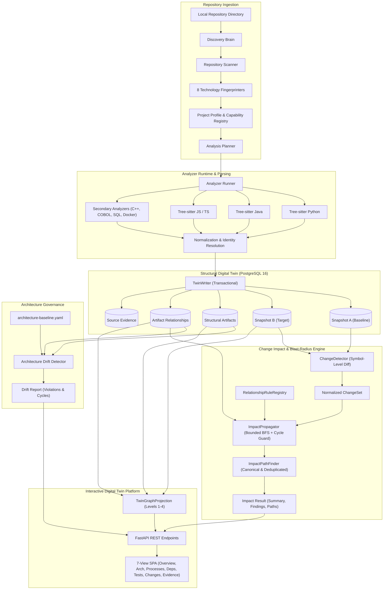

# AI-Powered Software Digital Twin for Change Impact Analysis

> An AI-powered Software Digital Twin for evidence-based change impact analysis across software artifacts, dependencies, APIs, processes, and tests.


---

## 1. What is This Project?

The **Software Digital Twin** builds an immutable, queryable, and snapshot-aware digital twin of a software codebase.

A Software Digital Twin is **not** a duplicate copy of source code. Instead, it is an evidence-backed structural and behavioral representation that maps:
- **Source Artifacts & Symbols**: Files, modules, packages, classes, interfaces, methods, functions, and configuration declarations.
- **Typed Relationships**: Invocations (`CALLS`), module imports (`IMPORTS`), inheritance (`EXTENDS`/`IMPLEMENTS`), dependencies (`DEPENDS_ON`), service consumption (`CONSUMES`), test bindings (`TESTS`), endpoint exposures (`EXPOSES`), and process transitions (`TRANSITIONS_TO`).
- **Software Discovery & Fingerprinting**: Automatic language detection, framework resolution, build-system parsing, and capability planning.
- **Snapshot Immutability**: Historical repository state tracking that enables deterministic differential analysis across commits and versions.
- **Architecture Baseline & Drift**: Machine-readable boundary validation that detects layer violations, circular dependencies, and unexpected coupling directly from AST evidence.
- **Change Impact & Blast Radius**: Deterministic graph propagation that identifies all downstream entities, APIs, processes, and tests affected by a code modification.

### Core Processing Pipeline

```
Repository (Local Filesystem)
   ↓
Discovery Brain (Fingerprinting & Technology Detection)
   ↓
Project Profile & Capability Registry (Levels 0–4)
   ↓
Analysis Planner (Prioritized Analyzer Selection)
   ↓
Analyzer Runtime (Tree-sitter & Native Parsers)
   ↓
Structural Extraction & Normalization
   ↓
Structural Digital Twin (Relational PostgreSQL Model)
   ↓
Evidence & Snapshot Model (Immutable Snapshot States)
   ↓
Graph Projection (Levels 1–4, NetworkX MultiDiGraph)
   ↓
Snapshot Comparison & Change Detector (Symbol-Level Diffs)
   ↓
Change Impact Engine (Bounded BFS + Cycle Protection)
   ↓
Evidence-Backed Blast Radius & Causal Impact Paths
```

---

## 2. The Core Problem

Modern software systems are dense dependency networks composed of microservices, shared libraries, API contracts, database schemas, and multi-tier test suites.

In everyday engineering:
1. **Unseen Ripple Effects**: A one-line signature change or field removal in a shared utility can propagate silently across multiple downstream consumers, causing deployment failures or production outages.
2. **Manual Impact Tracing**: Engineers rely on text search (`grep`), institutional memory, or anecdotal code reviews to guess what might break.
3. **Flaky & Overlooked Tests**: Teams lack deterministic mapping between modified functions and the specific test cases that execute or assert their behavior.
4. **Architecture Degradation**: As deadlines loom, layer boundaries erode and circular dependencies emerge unnoticed without continuous structural governance.

The **Software Digital Twin** solves this by maintaining a structured, snapshot-aware twin of the codebase in PostgreSQL. Instead of speculating, engineers and automated CI gates query deterministic evidence: *what changed, what depends on it, how deep does the propagation reach, and what proof links each step of the causal chain?*

---

## 3. Implemented Capabilities (Phases 1 → 4)

This repository represents the completed and validated implementation of **Phases 1, 2, 3, 3.X, and 4**, including stress and complication validation.

### Phase 1 — Core Foundation & Infrastructure
- **Relational Digital Twin Foundation**: 38 relational tables in PostgreSQL 16 defining repository state, structural artifacts, relationships, evidence, and schema foundations for future telemetry and risk evaluation.
- **Alembic Database Migrations**: Version-controlled migrations (`ee7d6d05e01c` through `1984aeb90969`).
- **Container Infrastructure**: Production-grade `docker-compose.yml` with isolated networks and health probes.
- **Health & Readiness Endpoints**: Liveness (`/health`) and readiness (`/ready`) probes verifying PostgreSQL connectivity.

### Phase 2 — Software Discovery Brain
- **Repository Inventory Scanner**: File hierarchy enumeration with pattern-based ignoring (`.git`, `node_modules`, `venv`, binary assets).
- **8 Deterministic Technology Fingerprinters**:
  1. *Languages*: Python, Java, JavaScript, TypeScript, Go, C/C++, COBOL.
  2. *Frameworks*: FastAPI, Flask, Django, Spring Boot, React, Next.js, Express.
  3. *Package Managers*: Pip, Poetry, Maven, Gradle, NPM, Yarn, Pnpm, Go Modules, Cargo.
  4. *Build Systems*: Make, CMake, Maven, Gradle.
  5. *Databases*: PostgreSQL, MySQL, SQLite, MongoDB, Redis.
  6. *APIs*: REST, GraphQL, gRPC, OpenAPI.
  7. *Testing*: Pytest, Unittest, JUnit, Jest, Vitest, Go Test.
  8. *Infrastructure*: Docker, Docker Compose, Kubernetes.
- **Capability Registry**: Maps detected technologies into 5 capability tiers:
  - *Level 0*: File & directory structure
  - *Level 1*: Surface discovery (modules, packages)
  - *Level 2*: Basic structural twin (classes, functions, imports)
  - *Level 3*: Deep semantic twin (method calls, inheritance, API routes, tests)
  - *Level 4*: Complete behavioral twin (process models, runtime traces)
- **Analysis Planner**: Generates deterministic execution plans tailoring analyzer priority to detected repository languages.

### Phase 3 — Structural Digital Twin & AST Analyzers
- **Production AST Parser Adapters**:
  - Tree-sitter C-grammar bindings for **Python, Java, JavaScript, and TypeScript** (`TreeSitterAdapter`).
  - Native Python `ast` visitor for zero-dependency local parsing.
- **Structural Extraction Engine**:
  - Extracts classes, methods, functions, symbols, imports, and calls with exact start/end line and column coordinates.
  - Generates deterministic, stable UUIDv5 identities for all artifacts and relationships.
- **Secondary Structural Analyzers**:
  - *COBOL Analyzer*: Division scanning, paragraph extraction, copybook inclusion graphs.
  - *C/C++ Analyzer*: Struct/class declarations, `#include` dependency graphs.
  - *Database Analyzer*: Table declarations, foreign key links, migration schemas.
  - *Docker Analyzer*: Multi-stage build detection, image hierarchy, exposed ports.
- **TwinWriter Persistence Engine**: Transactional PostgreSQL persistence preserving snapshot isolation, avoiding duplicates, and linking line-level evidence to each entity.

### Phase 3.X — Architecture Governance & Product Experience
- **Architecture Baseline (`docs/architecture-baseline.yaml`)**:
  - Machine-readable specification declaring architectural layers (presentation, services, discovery, analysis, architecture, domain, core), permitted dependencies, and forbidden couplings.
- **Deterministic Architecture Drift Detector**:
  - Extracts real repository import graphs and validates against baseline boundaries.
  - Detects layer violations and circular dependencies with line-level evidence and severity tags.
- **Obsidian-Style Interactive Digital Twin UI (`backend/app/static/`)**:
  - 7-view information architecture: **Overview**, **Architecture**, **Processes**, **Dependencies**, **Tests**, **Changes**, and **Evidence**.
  - Interactive HTML5 Canvas with custom force-directed physics, zoom/pan transforms, progressive disclosure levels (1–3), and ego-network depth traversal (1–5 hops).
  - Node Inspector & Edge Inspector displaying source coordinates, confidence scores, and caller/callee matrices.
  - Real local filesystem repository onboarding modal with animated analysis checklist.

### Phase 4 — Deterministic Change Impact & Blast-Radius Engine
- **Snapshot-Aware Diff Engine (`ChangeDetector`)**:
  - Compares Baseline Snapshot A vs. Target Snapshot B.
  - Detects changes at the **AST symbol level** (`FUNCTION`, `METHOD`, `CLASS`) via source hash and signature diffing.
  - Gracefully falls back to file-level diffing (`is_symbol_level=False`) when AST parsing is unavailable.
- **Centralized Propagation Rules (`RelationshipRuleRegistry`)**:
  - Explicit propagation direction (FORWARD, REVERSE, NONE) and edge confidence per relationship type.
  - Structural containment (`CONTAINS`) restricted to navigational hierarchy to prevent false blast-radius inflation.
- **Bounded BFS Graph Propagator (`ImpactPropagator`)**:
  - Executes bounded graph traversal from changed entities.
  - **Cycle Protection**: Terminating active-path branch tracking preventing infinite loops on circular dependencies.
  - **Depth Pruning**: Configurable `max_depth` (default: 5) preventing unbounded traversal.
  - **Historical Relationship Traversal**: Handles deleted artifacts (`REMOVED`) by querying Snapshot A's baseline edges to identify orphaned callers and broken tests.
- **Canonical Impact Path Finder (`ImpactPathFinder`)**:
  - Assembles causal chains connecting root modifications to affected components, APIs, processes, and tests.
  - Suppresses duplicate paths and produces deterministic ordering (sorted by depth ascending, then qualified name).
- **Interactive UI Integration**:
  - Integrated into the **Changes** view with instant snapshot diffing, blast-radius metrics grid, interactive causal path tree, evidence table, and canvas subgraph projection.

---

## 4. Architecture Diagram



---

## 5. Change Impact Methodology

The Phase 4 Change Impact Engine evaluates the exact blast radius of a change between two snapshots:

$$\text{Snapshot } A \quad+\quad \text{Snapshot } B \;\longrightarrow\; \text{Diff} \;\longrightarrow\; \text{ChangeSet} \;\longrightarrow\; \text{Bounded Propagation} \;\longrightarrow\; \text{Causal Blast Radius}$$

```
Snapshot A (Baseline) + Snapshot B (Target)
                  ↓
       Snapshot Diff (ChangeDetector)
                  ↓
          Normalized Change Set
                  ↓
       Changed Symbols / Files (Level 0)
                  ↓
 Typed Twin Relationships (RelationshipRuleRegistry)
                  ↓
 Bounded Graph Traversal (ImpactPropagator: BFS + Cycle Guard)
                  ↓
           Impact Findings
                  ↓
  Causal Impact Paths (ImpactPathFinder)
                  ↓
 Affected Components / Tests / APIs / Processes
```

### Relationship Propagation Rules

Propagation is strictly relationship-aware. It does not blindly traverse graph edges:

| Relationship | Propagation Direction | Semantics | Edge Confidence |
| :--- | :---: | :--- | :---: |
| `CALLS` | **REVERSE** | Callee modified $\rightarrow$ Caller is potentially affected | 0.85 |
| `IMPORTS` | **REVERSE** | Imported module modified $\rightarrow$ Importer is potentially affected | 0.95 |
| `DEPENDS_ON` | **REVERSE** | Dependency modified $\rightarrow$ Dependent component is potentially affected | 0.90 |
| `CONSUMES` | **REVERSE** | Service provider modified $\rightarrow$ Consumer is potentially affected | 0.85 |
| `TESTS` | **REVERSE** | Tested component modified $\rightarrow$ Test case is affected (must re-run) | 0.90 |
| `EXTENDS` | **REVERSE** | Base class modified $\rightarrow$ Subclass is potentially affected | 0.95 |
| `IMPLEMENTS` | **REVERSE** | Interface modified $\rightarrow$ Implementing class is potentially affected | 0.95 |
| `EXPOSES` | **FORWARD** | Internal logic modified $\rightarrow$ Public API endpoint is affected | 0.90 |
| `PARTICIPATES_IN`| **FORWARD** | Component modified $\rightarrow$ Business process workflow is affected | 0.85 |
| `TRANSITIONS_TO` | **FORWARD** | Process step modified $\rightarrow$ Downstream workflow step is affected | 0.90 |
| `CONTAINS` | **NONE** | Structural hierarchy navigation only; does not propagate blast radius | N/A |

### Impact Topological Distances
- **Level 0 (CHANGED)**: The entity that was directly modified, added, or removed.
- **Level 1 (DIRECTLY_AFFECTED)**: Immediate consumers or dependents (1 topological hop).
- **Level 2+ (INDIRECTLY_AFFECTED)**: Transitive dependents reached via multi-hop causal paths ($\ge 2$ hops).

---

## 6. Process, Evidence & Snapshot Models

### Process Model (Static Inference)
> **Note on Process Workflows**: Process and workflow sequences are currently synthesized from static AST declarations, API route definitions, and call relationships. They represent inferred static invocation flows, **not** live runtime telemetry or production execution traces.

The system distinguishes three process knowledge states:
- **Observed**: Recorded from real test runs or live telemetry (*Phase 5/6 roadmap*).
- **Static**: Extracted deterministically from AST syntax, function signatures, and explicit annotations.
- **Inferred**: Derived by chaining `PARTICIPATES_IN` and `TRANSITIONS_TO` edges across service calls.

### Evidence Hierarchy
The Digital Twin architecture is grounded on empirical evidence levels:

$$\text{Runtime Trace} \;>\; \text{Executed Test Trace} \;>\; \text{Explicit Dependency/API} \;>\; \text{Static Code AST} \;>\; \text{Documentation} \;>\; \text{Heuristic Inference} \;>\; \text{LLM Hypothesis}$$

In the current Phase 4 implementation:
- **Available Levels**: Static Code AST (`0.95–1.00`), Explicit Dependencies (`0.90`), Static Call Graphs (`0.85`), and Heuristic Inferences (`0.70`).
- **Upcoming Levels**: Executed Test Traces (*Phase 5/6*) and LLM Hypotheses (*Phase 9*).
- **Confidence Semantics**: Confidence numbers reflect **strength of supporting evidence**, *not* the probabilistic likelihood of operational system failure.

### Snapshot Model
The Digital Twin preserves complete historical immutability. When analyzing a repository change:
1. Snapshot $A$ is written once with all its artifacts and relationships.
2. Snapshot $B$ is written independently with its respective artifacts and relationships.
3. Neither snapshot is ever mutated or overwritten.
4. Diffing compares the two states in PostgreSQL, enabling repeatable, byte-for-byte deterministic impact analysis.

---

## 7. Stress & Complication Validation

To verify the engine against real-world graph anomalies, the implementation was evaluated against complex architectural topological edge cases:

| Complication Scenario | Failure Risk Addressed | Implementation Safeguard | Verified Result |
| :--- | :--- | :--- | :---: |
| **1. Diamond Dependency Convergence** | Path explosion when multiple paths reach the same downstream target (`A → B1 → Target`, `A → B2 → Target`) | `ImpactPathFinder` deduplication and canonicalization | **PASSED**: Unique canonical paths preserved; zero redundant duplicate node sequences |
| **2. Circular Dependencies** | Infinite loops / stack overflows during graph propagation (`A → B → C → A`) | Active-path branch set tracking in `ImpactPropagator` | **PASSED**: Cycles detected and safely halted; 0 infinite loops |
| **3. Removed Artifact with Callers** | Broken references when a deleted entity exists only in Snapshot A | Historical baseline edge traversal on `REMOVED` change types | **PASSED**: Callers of removed functions accurately flagged as affected |
| **4. Unrelated Component Isolation** | False-positive noise in unrelated subsystems | Strict topological reachability validation | **PASSED**: Completely disconnected components receive 0 impact findings |
| **5. Maximum-Depth Cutoff** | Runaway traversals across large monolithic codebases | Hard boundary enforcement via `max_depth` configuration | **PASSED**: Traversal terminates strictly at configured depth boundary |
| **6. Multi-Tier Test Impact** | Inability to trace changes through deep service layers to tests | Transitive propagation through `CALLS` $\rightarrow$ `TESTS` | **PASSED**: Tests at depth 1, 2, and 3 accurately identified |

---

## 8. Technology Stack

### Backend & Core
- **Language**: Python 3.12+
- **API Framework**: FastAPI 0.115+
- **ASGI Server**: Uvicorn 0.30+
- **Validation**: Pydantic v2.8+
- **Graph Algorithms**: NetworkX 3.3+ (multi-directed graph projection)
- **CLI Framework**: Typer & Rich 13.7+

### Database & Persistence
- **RDBMS**: PostgreSQL 16 (running on container port 5434)
- **ORM**: SQLAlchemy 2.0+
- **Migrations**: Alembic 1.13+
- **Drivers**: Psycopg2-binary & Psycopg 3

### Static Analysis & AST Parsing
- **AST Parsing**: Tree-sitter 0.21.3+
- **Official Grammars**: `tree-sitter-python`, `tree-sitter-java`, `tree-sitter-javascript`, `tree-sitter-typescript`
- **Native Parser**: Python `ast` visitor
- **Structural Regex Analyzers**: C++, COBOL, SQL, Dockerfile

### Frontend & User Interface
- **Architecture**: Single Page Application (SPA) served via FastAPI (`/app`)
- **Core Logic**: Vanilla JavaScript (ES6+ modular, zero bundler dependencies)
- **Styling**: Vanilla CSS Design System with dark technical SaaS aesthetics and glassmorphism
- **Graph Rendering**: HTML5 Canvas with custom force-directed spring-charge physics simulation

### Infrastructure & Validation
- **Containers**: Docker & Docker Compose
- **Unit & Integration Testing**: Pytest 8.3+, Pytest-Asyncio
- **Browser Automation**: Chrome DevTools Protocol (CDP) headless browser validation

---

## 9. Database & Digital Twin Data Model

The PostgreSQL schema defines **38 relational tables** organized into functional categories:

```
Core Hierarchy:
  projects ───────────< repositories ───────────< repository_snapshots
                             │
                             ├───────────────< branches
                             ├───────────────< commits
                             └───────────────< files

Discovery Brain:
  technology_profiles ───< technologies ───────────< technology_evidence
  project_capabilities ───< capabilities
  analysis_plans ─────────< analyzers

Structural Digital Twin:
  structural_artifacts ───< artifact_relationships
            │
            ├────────────< evidence
            └────────────< code_symbols

Process & Architecture:
  process_definitions ────< process_steps ──────────< process_transitions
  architecture_reports ───< architecture_drifts

Analysis Runs & Foundation:
  analysis_runs (run_type="structural", "discovery", "change_impact")
  dependencies, configurations, environments, api_endpoints, database_entities

Schema Foundation for Future Phases (Defined in DDL, populated in Phases 5+):
  test_executions, incidents, runtime_events, scenarios, scenario_results, risk_assessments, agent_runs
```

> **Schema Foundation vs. Implemented Feature**: Tables such as `runtime_events`, `incidents`, and `risk_assessments` exist in the database schema as architectural foundations, but the active intelligence and runtime collectors for those features are scheduled for subsequent phases.

---

## 10. API Surface Overview

All REST API endpoints are exposed on `http://localhost:8000`:

| Category | HTTP Method | Endpoint | Description |
| :--- | :---: | :--- | :--- |
| **System** | `GET` | `/` | Root service metadata and navigation links |
| | `GET` | `/health` | Liveness probe returning service status |
| | `GET` | `/ready` | Readiness probe confirming PostgreSQL connectivity |
| | `GET` | `/app` | Serves the interactive Digital Twin Single Page Application |
| **Status** | `GET` | `/status` | Project execution status and milestone completion percentage |
| | `GET` | `/status/phases` | Phase-by-phase completion register and milestone breakdown |
| **Discovery** | `POST` | `/discovery/scan` | Scans directory, detects technologies, generates analysis plan |
| **Analysis** | `POST` | `/analysis/structural` | Executes full AST structural analysis and persists twin |
| | `GET` | `/analysis/{id}/drifts`| Retrieves architecture drift violations for an analysis run |
| **Architecture** | `POST` | `/architecture/check` | Evaluates AST relationships against architectural baseline |
| | `POST` | `/architecture/diff` | Compares architecture drift between two historical snapshots |
| **Twin & Graph** | `GET` | `/repositories` | Lists all onboarded repositories and active snapshots |
| | `POST` | `/repositories/onboard`| Ingests local repository directory and builds Digital Twin |
| | `GET` | `/repositories/{id}/overview` | Returns aggregate metrics, component breakdown, and pipeline status |
| | `GET` | `/repositories/{id}/components` | Returns structural components with source coordinates and confidence |
| | `GET` | `/repositories/{id}/tests-map` | Returns test cases mapped to covered components |
| | `GET` | `/repositories/{id}/graph` | Projects graph filtered by level (1–4), depth (1–5), or focus node |
| | `GET` | `/repositories/{id}/graph/snapshots` | Enumerates snapshots with artifact/relationship counts |
| | `GET` | `/repositories/{id}/file-tree` | Hierarchical file/directory tree with artifact counts |
| | `GET` | `/repositories/{id}/process-graph` | Synthesized process workflow graph with step sequences |
| **Change Impact**| `POST`| `/repositories/{id}/impact-analysis` | **Runs change impact / blast-radius analysis between snapshots** |
| | `GET` | `/repositories/{id}/impact-analysis/{analysis_id}` | Retrieves persisted impact analysis findings and causal paths |
| | `GET` | `/repositories/{id}/impact-analysis/{analysis_id}/graph` | Projects impact-focused subgraph (changed + affected nodes) |

---

## 11. Empirical Validation & Test Evidence

The repository is validated by an automated unit, integration, regression, and browser test suite:

### Test Suite Execution Summary
- **Total Tests**: **63 passed / 63 total (100% green)** in 0.99 seconds.
- **Test Suite Breakdown**:
  - `backend/tests/test_analysis.py`: **13 / 13 passed** (Tree-sitter adapters, AST extractors, secondary analyzers, idempotency).
  - `backend/tests/test_architecture.py`: **10 / 10 passed** (Baseline loading, intentional drift detection, 100% drift resolution, snapshot drift, circular dependencies).
  - `backend/tests/test_discovery.py`: **9 / 9 passed** (8 polyglot ground-truth fixtures + discovery persistence & API).
  - `backend/tests/test_graph.py`: **10 / 10 passed** (Projection levels 1–4, depth filtering, snapshot diff, impact mode, file tree).
  - `backend/tests/test_health.py`: **3 / 3 passed** (Root, `/health`, `/ready` database readiness).
  - `backend/tests/test_impact.py`: **17 / 17 passed** (All 14 Phase 4 impact scenarios + 3 API lifecycle tests).
  - `backend/tests/test_models.py`: **1 / 1 passed** (Project hierarchy and entity persistence).

### Architecture Conformance Precision
- **Baseline Rule Count**: 57 architectural boundary specifications defined in `docs/architecture-baseline.yaml`.
- **Evaluated Boundaries**: 7 core production modules currently validated.
- **Conformance Score**: **100.0% conformance among validated boundaries** (0 violations, 0 circular dependencies in production core).
  *(Note: The baseline contains additional boundaries for future subsystems that are not independently evaluated by this specific run).*

### Browser & CDP Runtime Verification
- **Automated Chrome DevTools Protocol (CDP) Verification**:
  - Validated all 7 primary UI views against live PostgreSQL data.
  - Verified canvas force physics, level disclosure (L1 $\rightarrow$ L2 $\rightarrow$ L3), node inspector, instant snapshot diffing, and blast-radius execution.
  - **Console Errors**: **0 console errors** logged across all interaction flows.
  - **Network Errors**: **0 failed network requests** (all APIs returned 200 OK or 204 No Content).

---

## 12. Local Setup & Execution

### Prerequisites
- Python 3.12+
- Docker & Docker Compose
- Git

### 1. Clone & Setup Virtual Environment
```bash
git clone https://github.com/Sanjayshaa/software-digital-twin.git
cd software-digital-twin

# Create and activate Python virtual environment
python3.12 -m venv .venv
source .venv/bin/activate

# Install backend dependencies
pip install -r backend/requirements.txt
```

### 2. Configure Environment
```bash
cp .env.example .env
# Default settings connect to PostgreSQL on port 5434
```

### 3. Start PostgreSQL Database
```bash
docker compose up -d postgres
```

### 4. Run Database Migrations
```bash
cd backend
alembic upgrade head
cd ..
```

### 5. Launch Backend & Web Platform
```bash
PYTHONPATH=backend python backend/main.py
```
The system will be available at:
- **Interactive Digital Twin UI**: [http://localhost:8000/app](http://localhost:8000/app)
- **Interactive Swagger API Docs**: [http://localhost:8000/docs](http://localhost:8000/docs)
- **Health Check**: [http://localhost:8000/health](http://localhost:8000/health)
- **Database Readiness**: [http://localhost:8000/ready](http://localhost:8000/ready)

### 6. Run Automated Test Suite
```bash
PYTHONPATH=backend ./.venv/bin/python -m pytest backend/tests/ -v
```

### 7. CLI Usage
The repository includes an executable CLI wrapper (`./digital-twin`):
```bash
# Discover technologies in a repository
./digital-twin discover /path/to/target/repo

# Analyze and build a Digital Twin snapshot
./digital-twin analyze /path/to/target/repo

# Check architectural baseline and detect drift
./digital-twin arch check /path/to/target/repo

# Run Change Impact / Blast-Radius Analysis between two snapshots
./digital-twin impact-analysis --repository <repo-id> --base <snap-a> --target <snap-b> --max-depth 5
```

---

## 13. Repository Structure

```
.
├── backend/
│   ├── alembic.ini                   # Alembic migration configuration
│   ├── app/
│   │   ├── api/                      # FastAPI route controllers
│   │   │   ├── analysis.py           # /analysis/structural, /analysis/{id}/drifts
│   │   │   ├── architecture.py       # /architecture/check, /architecture/diff
│   │   │   ├── discovery.py          # /discovery/scan
│   │   │   ├── graph.py              # /repositories, /onboard, /overview, /graph
│   │   │   ├── health.py             # /health, /ready
│   │   │   ├── impact.py             # /impact-analysis (Phase 4 REST API)
│   │   │   └── status.py             # /status, /status/phases
│   │   ├── core/                     # Application configuration & database session
│   │   │   ├── config.py
│   │   │   └── database.py
│   │   ├── models/                   # SQLAlchemy entities & Pydantic domain models
│   │   │   ├── domain.py
│   │   │   └── entities.py           # 38 Relational database tables
│   │   ├── services/                 # Core domain engines
│   │   │   ├── analysis/             # Phase 3 Structural Intelligence
│   │   │   │   ├── analyzers/        # Multi-language analyzers (Python, Java, TS, COBOL, etc.)
│   │   │   │   ├── graph/            # TwinGraphProjection (NetworkX)
│   │   │   │   ├── normalizers/      # Deterministic identity resolution (UUIDv5)
│   │   │   │   ├── parsers/          # Tree-sitter AST & native parser adapters
│   │   │   │   ├── persistence/      # TwinWriter transactional PostgreSQL persistence
│   │   │   │   ├── query/            # TwinQueryService
│   │   │   │   └── runtime/          # AnalysisRunner & execution context
│   │   │   ├── architecture/         # Architecture baseline & drift detection
│   │   │   │   ├── comparator.py
│   │   │   │   ├── detector.py
│   │   │   │   └── models.py
│   │   │   ├── discovery/            # Phase 2 Software Discovery Brain
│   │   │   │   ├── detectors/        # 8 Technology fingerprinters
│   │   │   │   ├── planner.py        # Analysis planner
│   │   │   │   ├── registry.py       # Capability registry (Levels 0–4)
│   │   │   │   └── scanner.py        # File inventory scanner
│   │   │   ├── impact/               # Phase 4 Change Impact Engine
│   │   │   │   ├── analyzer.py       # Change impact orchestrator
│   │   │   │   ├── change_detector.py# Symbol-level snapshot diffing
│   │   │   │   ├── models.py         # Strongly typed impact models
│   │   │   │   ├── path_finder.py    # Deduplicated causal path finder
│   │   │   │   ├── propagator.py     # Bounded BFS graph propagator
│   │   │   │   ├── rules.py          # Centralized relationship propagation rules
│   │   │   │   └── service.py        # Impact execution service
│   │   │   └── status/               # Continuous execution status tracker
│   │   └── static/                   # Production Single Page Application
│   │       ├── index.html            # 7-View UI & Onboarding Modal
│   │       ├── twin.css              # Custom Dark SaaS Design System
│   │       └── twin.js               # Reactive frontend engine & Canvas physics
│   ├── main.py                       # FastAPI application entry point
│   ├── migrations/                   # Alembic database migrations
│   │   └── versions/                 # 5 Schema version files
│   ├── requirements.txt              # Production Python dependencies
│   └── tests/                        # 63 Automated unit & integration tests
│       ├── fixtures/                 # 8 Ground-truth polyglot testbeds
│       ├── test_analysis.py          # Structural parser & analyzer tests (13 tests)
│       ├── test_architecture.py      # Governance, drift, & circular dependency tests (10 tests)
│       ├── test_discovery.py         # Technology detector & planner tests (9 tests)
│       ├── test_graph.py             # Graph projection & API tests (10 tests)
│       ├── test_health.py            # Health & readiness tests (3 tests)
│       ├── test_impact.py            # Phase 4 change impact tests (17 tests)
│       └── test_models.py            # Entity persistence tests (1 test)
├── cli/                              # CLI source code
│   └── main.py                       # Typer CLI commands
├── docs/                             # Engineering specifications & baselines
│   ├── ARCHITECTURE.md               # Decoupled layered architecture documentation
│   ├── CHANGE_IMPACT.md              # Phase 4 change impact technical specification
│   ├── GRAPH_MODEL.md                # Graph projection semantics & evidence traceability
│   ├── STRUCTURAL_TWIN.md            # Structural AST parsing specification
│   └── architecture-baseline.yaml    # 57 Machine-readable architectural boundaries
├── digital-twin                      # Executable CLI wrapper
├── docker-compose.yml                # PostgreSQL 16 container definition
├── pytest.ini                        # Pytest configuration
├── PROJECT_EXECUTION_LOG.md          # Authoritative chronological project audit log
└── README.md                         # Authoritative repository documentation
```

---

## 14. Engineering Principles

1. **Deterministic Analysis First**: Core dependency extraction, drift detection, and change impact propagation are strictly mathematical and algorithmic (Tree-sitter AST, NetworkX graph traversals, bounded BFS). Zero non-deterministic hallucinations in the core engine.
2. **Evidence Over Speculation**: Every edge, finding, and impact path must link to line-level source code evidence. Confidence scores represent empirical evidence strength, not ungrounded probabilities.
3. **Digital Twin as the Source of Truth**: The relational PostgreSQL database stores the authoritative model of the software system. Graphs are projections of this twin, not unpersisted in-memory caches.
4. **Snapshot Immutability**: Historical snapshots are never altered. Snapshot comparisons are pure functions over immutable states.
5. **Bounded Traversal & Cycle Protection**: Real code contains cycles and deep dependency chains. Traversals must be bounded by depth limits and protected against infinite loops.
6. **Read-Only Codebase Inspection**: The system inspects, parses, and models repositories without executing arbitrary repository code, preventing remote execution vulnerabilities.
7. **The Engineer Decides**: The Digital Twin is an engineering intelligence tool. It surfaces blast radius, affected tests, and architectural drift with full transparency so engineers remain the final decision-makers.

---

## 15. Current Limitations

In adherence to scientific rigor and honest engineering documentation, the following limitations apply to the current Phase 4 implementation:

- **Dynamic Reflection & Metaprogramming**: Dynamic Python `getattr()` invocations, Java reflection, or dynamic dependency injection bindings without static call targets cannot be fully resolved statically.
- **Runtime Telemetry**: Dynamic OpenTelemetry trace ingestion and production traffic correlation are scheduled for subsequent phases. Current process workflows are statically inferred from AST call structures.
- **Secondary Language Semantics**: C++, COBOL, and SQL analyzers currently extract structural declarations and dependency graphs rather than deep semantic call graphs.
- **Remote Repository Sync**: Remote Git authentication and automatic repository synchronization are planned future capabilities. Currently, local filesystem directory paths are fully supported via the Onboarding modal and CLI.
- **ZIP Archive Ingestion**: Direct browser archive uploading is a planned future capability.
- **No LLM / AI Agents in Core**: The current Phase 4 blast-radius engine is strictly deterministic; generative AI copilot agents and RAG explanation layers are scheduled for future phases.

---

## 16. Project Roadmap

```
[COMPLETED] Phase 1: Core Foundation, PostgreSQL Relational Schema & Docker Infrastructure
      ↓
[COMPLETED] Phase 2: Software Discovery Brain, Technology Fingerprinting & Capability Registry
      ↓
[COMPLETED] Phase 3: Structural Digital Twin, Tree-sitter Multi-Language Parsers & Persistence
      ↓
[COMPLETED] Phase 3.X: Architecture Governance, Drift Detection & 7-View Digital Twin Platform
      ↓
[COMPLETED] Phase 4: Deterministic Change Impact & Blast-Radius Engine (Stress Validated)
      ↓
[PLANNED]   Phase 5: Process Twin + Runtime Evidence / Minimum Runtime Incident Intelligence
      ↓
[PLANNED]   Phase 6: Test Impact Analysis
      ↓
[PLANNED]   Phase 7: Risk Intelligence
      ↓
[PLANNED]   Phase 8: Scenario Simulation
      ↓
[PLANNED]   Phase 9: AI Intelligence / RAG / Agents
      ↓
[PLANNED]   Phase 10: Production Hardening & Deployment
```

---

## 17. Academic & Software Engineering Positioning

This project bridges **Static Program Analysis**, **Software Architecture Governance**, and **Digital Twin Engineering**:

- **Static Program Analysis**: Leverages concrete syntax trees (Tree-sitter) and compiler theory to extract structural symbols, declarations, and call graphs without runtime overhead.
- **Software Digital Twin Modeling**: Adapts cyber-physical digital twin paradigms to software engineering, treating codebases as evolving, stateful systems with observable structural health and historical snapshots.
- **Graph Algorithms in Software Engineering**: Employs bounded graph algorithms, cycle-guarded breadth-first search, and ego-network projections to solve the classic Change Impact Analysis (CIA) problem.
- **Empirical Software Architecture**: Replaces subjective architectural guidelines with machine-readable baseline enforcement (`architecture-baseline.yaml`), quantifying architecture erosion and drift as measurable metrics.

---

## 18. License & Attribution

This project is licensed under the MIT License. See [THIRD-PARTY-NOTICES.md](file:///Users/sanjay/DIGITAL%20TWIN%20/THIRD-PARTY-NOTICES.md) for open-source tree-sitter grammars and library acknowledgments.
